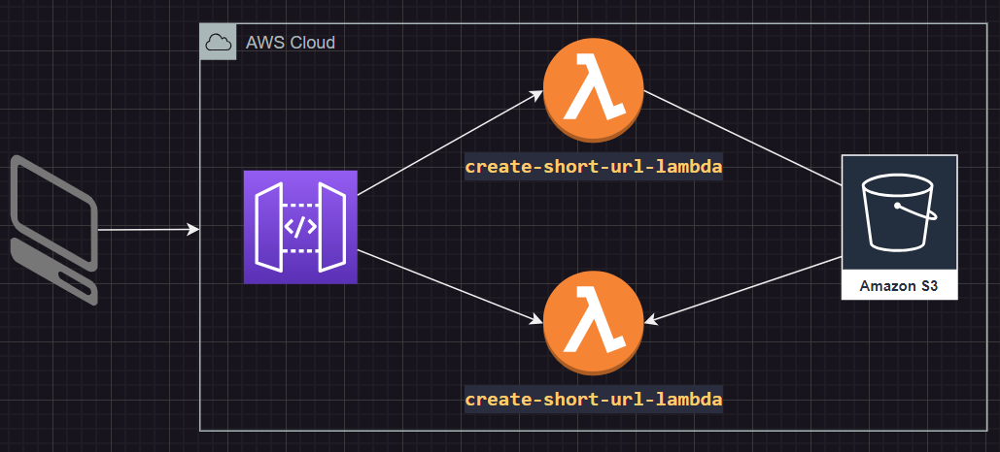

# AWS Lambda URL Shortener

This project is a URL shortener application developed as part of a Java course offered by Rocketseat. It utilizes AWS services, including AWS Lambda and Amazon S3, to create a serverless architecture. The application enables users to generate short URLs that redirect to their original URLs.

## Key Features

The application consists of two main AWS Lambda functions:

- **create-short-url-lambda**: This function generates and stores the shortened links in an S3 Bucket, along with the original URL and its expiration time.
- **redirect-short-url-lambda**: This function handles the redirection process by verifying the shortened URL and checking if it is still valid based on its expiration time before redirecting the user.



## Getting Started

Feel free to fork or clone this repository to explore and experiment with the code.

## Skills Documented: Steps to build the project from scratch

In this section, I will outline the skills and concepts learned throughout the course.

### 1. Create a project

mvn archetype:generate -DgroupId=com.example -DartifactId=url-shortener -DarchetypeArtifactId=maven-archetype-quickstart -DinteractiveMode=false

### 2. Update POM to use Java 17

```xml
<properties>
    <maven.compiler.source>17</maven.compiler.source>
    <maven.compiler.target>17</maven.compiler.target>
</properties>
```

### 3. Build and Run

```bash
mvn clean install
mvn exec:java -Dexec.mainClass="com.example.App"
```

## Now, let's start project implementation

Add the following dependencies:

The project uses the following main dependencies:

    AWS Lambda Java Core (1.2.1)
    AWS Lambda Java Log4j2 (1.4.0)
    AWS SDK for Java v2 - S3 (2.17.106)
    Jackson Databind (2.12.3)

In order to simplify deployment on AWS, we will use the Maven Shade Plugin. This plugin bundles all project dependencies into a single fat JAR file, making it easier to manage and deploy the application without worrying about external libraries.

Update your `pom.xml` file accordingly as follows:

```xml
  <build>
    <plugins>
      <plugin>
        <groupId>org.apache.maven.plugins</groupId>
        <artifactId>maven-shade-plugin</artifactId>
        <version>3.2.4</version>
        <executions>
          <execution>
            <phase>package</phase>
            <goals>
              <goal>shade</goal>
            </goals>
            <configuration>
              <createDepenpencyReducedPom>false</createDepenpencyReducedPom>
            </configuration>
          </execution>
        </executions>
      </plugin>
    </plugins>
  </build>
```